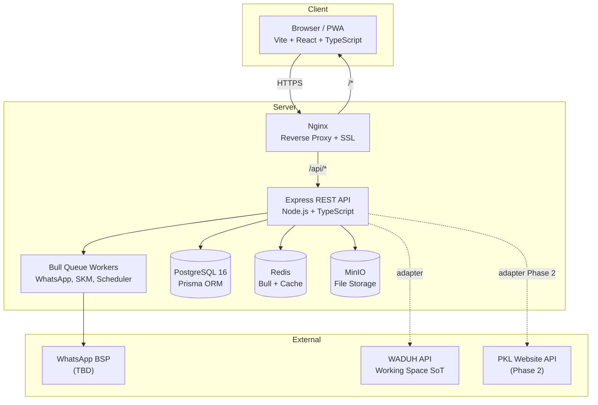

# System Architecture — CTP Digital Service Portal

> Stack: Vite + React + TypeScript (Frontend) | Node.js + Express + TypeScript (Backend) | PostgreSQL 16 + Prisma ORM

---

## 1. System Overview

The CTP Digital Service Portal is a full-custom web application. It does NOT use Odoo or any off-the-shelf platform. The system consists of two applications:
- **Frontend**: Single Page Application (SPA) built with Vite + React + TypeScript
- **Backend**: REST API server built with Node.js + Express + TypeScript

### Architecture Diagram



---

## 2. Frontend Architecture

### Tech Stack
| Teknologi | Kegunaan |
|---|---|
| Vite 5 + React 18 + TypeScript 5 | Core frontend |
| Tailwind CSS + shadcn/ui | Styling dan komponen |
| React Router v6 | Client-side routing |
| Zustand | State management |
| Axios + React Query | HTTP client + server state caching |
| React Hook Form + Zod | Form dan validasi |

### Page Structure

**Public (tanpa login):**
- `/` - Landing page (layanan, fasilitas, kalender, pengumuman, FOKUS)
- `/layanan` - Daftar semua layanan
- `/ruangan` - Daftar ruangan + filter gedung/tanggal
- `/ruangan/:id` - Detail ruangan (foto, fasilitas, tarif, ketersediaan)
- `/fokus` - Katalog foto produk FOKUS

**Auth:**
- `/login` - Login
- `/daftar` - Registrasi pemohon baru

**Portal Pemohon (wajib login):**
- `/portal/dashboard` - Dashboard (status pengajuan, aktivitas mendatang, notifikasi)
- `/portal/pengajuan` - Daftar semua pengajuan saya
- `/portal/pengajuan/:id` - Detail pengajuan + dossier
- `/portal/pembayaran` - Status pembayaran
- `/portal/dokumen` - Dokumen saya
- `/portal/skm` - SKM pending
- `/portal/favorit` - Ruangan dan layanan favorit

**Admin (ADMIN, KASUBAG_TU, KEPALA_UPTD):**
- `/admin/dashboard` - Operational Control Center
- `/admin/booking` - Kelola semua booking
- `/admin/booking/:id` - Detail + approve/reject/edit
- `/admin/pembayaran` - Verifikasi pembayaran
- `/admin/pic` - Kelola PIC assignment
- `/admin/laporan` - Laporan + export
- `/admin/master` - Master data (ruangan, tarif, pegawai, template WA, dll)
- `/admin/kalender` - Kalender kegiatan

**Ringkas (SEKRETARIS, KEPALA_DINAS, KEPALA_UPTD):**
- `/monitoring/dashboard` - Agenda + ringkasan kegiatan

### State Management (Zustand)
```typescript
// authStore: user info + access token
// bookingStore: state form booking yang sedang diisi
// notifStore: jumlah notifikasi belum dibaca
```

### API Communication
```typescript
// Axios instance dengan interceptor:
// - Auto-attach JWT di setiap request
// - Auto-refresh token jika response 401
// - Redirect ke /login jika refresh gagal
```

---

## 3. Backend Architecture

### Tech Stack
| Teknologi | Kegunaan |
|---|---|
| Node.js 20 LTS + Express 4 + TypeScript 5 | Core backend |
| Prisma 5 | ORM + schema + migrations |
| Zod | Input validation |
| bcrypt + jsonwebtoken | Auth |
| Bull 4 + Redis | Job queue untuk async tasks |
| multer + minio client | File upload ke MinIO |
| helmet + cors | Security headers |

### Layered Architecture
```
HTTP Request
    |
[Routes]         -> Hanya mendefinisikan path dan middleware chain
    |
[Middleware]     -> authenticate, requireRole, validate(zod), rateLimiter
    |
[Controllers]    -> Terima req, panggil service, kirim res (tipis, tanpa business logic)
    |
[Services]       -> Semua business logic, BR-* enforcement, AuditLog creation
    |
[Prisma]         -> ORM queries ke PostgreSQL 16
    |
[PostgreSQL 16]
```

### Folder Structure
```
backend/src/
├── routes/            <- Express Router per domain
├── controllers/       <- Request handlers (tipis)
├── services/          <- Business logic, BR-* enforcement
├── middleware/        <- authenticate, rbac, validate, errorHandler
├── jobs/              <- Bull queue job processors
├── integrations/      <- WADUH, PKL, WhatsApp adapters
├── utils/             <- crypto, minio, errors, bookingNumber
└── app.ts
backend/prisma/
├── schema.prisma      <- SINGLE SOURCE OF TRUTH untuk schema
└── migrations/
```

---

## 4. Database (PostgreSQL 16 + Prisma)

### Migration Workflow
```bash
# Development
npx prisma migrate dev --name deskripsi_perubahan

# Production
npx prisma migrate deploy
npx prisma generate
```

### Prisma Conventions
- Primary key: `String @id @default(cuid())`
- Timestamps: `createdAt DateTime @default(now())` dan `updatedAt DateTime @updatedAt`
- Enums: selalu gunakan Prisma enum, bukan String kolom
- Index: `@@index` pada semua foreign key dan field yang sering difilter
- Soft delete: `isActive Boolean @default(true)` untuk master data; audit log tidak pernah dihapus

---

## 5. File Storage (MinIO)

```
ctp-documents/
├── booking-documents/{bookingId}/{documentId}/{versionId}/{filename}
├── payment-proofs/{bookingId}/{paymentId}/{filename}
├── room-photos/{roomId}/{filename}
├── fokus-catalog/{catalogId}/{filename}
└── templates/{templateId}/{filename}
```

**Akses file**: selalu menggunakan MinIO Presigned URL dengan expiry 15 menit.
**TIDAK BOLEH** ada file yang disimpan di filesystem server Express.

---

## 6. Background Jobs (Bull + Redis)

| Job | Trigger | Aksi |
|---|---|---|
| `send-whatsapp` | State change booking, PIC assignment | Kirim WA via BSP adapter |
| `skm-reminder` | 24 jam setelah checkout | Kirim ulang reminder SKM |
| `payment-deadline-check` | Cron setiap jam | Flag booking payment overdue |
| `skm-timeout` | Cron harian | Auto-close SKM yang sudah timeout |

---

## 7. Integration Architecture (Adapter Pattern)

```typescript
// Interface umum
interface WhatsAppAdapter {
  sendMessage(phone: string, templateKey: string, variables: Record<string, string>): Promise<void>;
}
// Implementasi spesifik BSP (Wati, Qiscus, dll) implements interface ini
// Untuk ganti BSP = ganti hanya file implementasi adapter
```

Semua integration logic hidup di `backend/src/integrations/`.
Controller dan service TIDAK boleh import langsung dari library BSP.

---

## 8. Deployment

### Local Development
```yaml
# docker-compose.yml (infrastruktur saja, bukan app)
services:
  postgres:
    image: postgres:16-alpine
    ports: ["5432:5432"]
    environment:
      POSTGRES_DB: ctp_dev
      POSTGRES_USER: ctp
      POSTGRES_PASSWORD: secret
  redis:
    image: redis:7-alpine
    ports: ["6379:6379"]
  minio:
    image: minio/minio
    command: server /data --console-address ":9001"
    ports: ["9000:9000", "9001:9001"]
```

### Production
- Nginx: reverse proxy + SSL (Let's Encrypt)
- Backend: PM2 cluster mode
- Frontend: Nginx serve static build (`vite build`)
- PostgreSQL 16 + Redis + MinIO: self-hosted atau managed
- Backup: cron `pg_dump` + MinIO bucket replication
