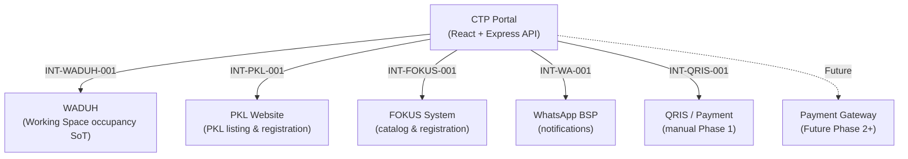

# Integration Architecture — CTP Digital Service Portal

> Stack: Node.js + Express (backend) | React (frontend) | PostgreSQL 16 + Prisma

---

## 1. Integration Overview



---

## 2. Integration Principles

- **Semua integrasi melalui `backend/src/integrations/` adapter layer** — controller tidak boleh import langsung library BSP/eksternal
- Tidak ada direct database coupling antara portal dan sistem eksternal
- Source of truth per domain sudah ditetapkan (lihat `docs/Source-of-Truth.md`)
- Semua integration calls dicatat di tabel `IntegrationLog` (Prisma model)
- Adapter bersifat stateless dan idempotent jika memungkinkan
- Retry dengan exponential backoff untuk transient failure
- Jika sistem eksternal down: tampilkan pesan yang jelas, jangan tampilkan data stale sebagai "tersedia"

```typescript
// Semua adapter implement interface ini
// backend/src/integrations/BaseAdapter.interface.ts
interface BaseAdapter {
  fetch(endpoint: string, params?: Record<string, unknown>): Promise<unknown>;
  push(endpoint: string, payload: Record<string, unknown>): Promise<unknown>;
}
// Setiap integration call wajib log ke IntegrationLog via logIntegrationCall()
```

---

## 3. INT-WADUH-001: Working Space BITC Integration

| Field | Value |
|---|---|
| Integration ID | INT-WADUH-001 |
| External System | WADUH (existing application) |
| Purpose | Sync Working Space BITC availability untuk portal display |
| Direction | Bidirectional (baca availability dari WADUH; tulis booking baru ke WADUH jika diperlukan) |
| Source of Truth | **WADUH** adalah sistem otoritatif untuk WS occupancy |
| Data Flow | Portal baca: available slots, current occupancy. Portal tulis: new WS booking (jika applicable) |
| API Strategy | REST API jika WADUH expose-nya; atau buat adapter dari WADUH source code. **OQ-012: Does WADUH have an API?** |
| Authentication | API key atau JWT (negosiasi dengan maintainer WADUH) |
| Failure Handling | Jika WADUH tidak merespons: tampilkan "Informasi ketersediaan sementara tidak tersedia, hubungi Admin". **JANGAN tampilkan 'Tersedia' jika tidak bisa konfirmasi ke WADUH** |
| Retry | 3 kali dengan exponential backoff; circuit open 5 menit jika gagal terus |
| Cache | Availability cache Redis TTL 5 menit. Setelah TTL habis, re-fetch. Jangan sajikan stale availability sebagai konfirmasi |
| Logging | Semua calls dicatat di tabel `IntegrationLog` |
| Constraint | **WAJIB**: Portal tidak boleh menampilkan "Tersedia" jika WADUH mengatakan "Penuh" |

> [!WARNING]
> **OPEN QUESTION OQ-012**: WADUH API availability dan protokolnya belum diketahui. Jika tidak ada API: (a) buat adapter API layer di WADUH source code, atau (b) baca DB WADUH langsung (sangat tidak disarankan, melanggar SOT principle). Keputusan dari stakeholder diperlukan.

---

## 4. INT-PKL-001: PKL/Internship Website Integration

| Field | Value |
|---|---|
| Integration ID | INT-PKL-001 |
| External System | Website PKL/Magang existing |
| Purpose | Tampilkan daftar lowongan PKL di portal; arahkan pelamar ke sistem pendaftaran PKL |
| Direction | Read-only dari sistem PKL (portal hanya display data dari PKL website) |
| Source of Truth | **PKL website** adalah SoT untuk data pendaftaran PKL |
| Data Flow | Portal baca daftar lowongan PKL. Portal **TIDAK** menyimpan data pendaftaran PKL |
| Strategy | Opsi A: PKL website expose API → portal fetch dan display. Opsi B: Portal hanya link ke halaman PKL website (tidak ada integrasi). **OQ-013: belum diputuskan** |
| Failure | Jika PKL system tidak tersedia: tampilkan daftar yang di-cache dengan notice 'data mungkin tidak terkini' |
| Logging | Semua API calls dicatat di `IntegrationLog` |
| Phase 1 | Admin buat listing PKL manual di portal. Integrasi penuh di Phase 2 |
| Post-Approval | Saat Admin approve PKL: generate surat pengantar TTE ke Bakesbangpol (template PDF). Internal portal, tidak sync ke sistem PKL kecuali diperlukan |

---

## 5. INT-FOKUS-001: FOKUS Catalog

| Field | Value |
|---|---|
| Integration ID | INT-FOKUS-001 |
| External System | Sistem foto produk FOKUS |
| Purpose | Tampilkan katalog foto produk di portal; arahkan ke pendaftaran FOKUS |
| Direction | One-way: portal tampilkan katalog yang dikelola Admin di DB kita (`FokusCatalog` Prisma model) |
| Strategy | Entri katalog dikelola Admin di portal (CRUD `FokusCatalog`). Pendaftaran: static link ke sistem/website FOKUS eksternal |
| Scope | Portal **TIDAK** mengambil alih pendaftaran FOKUS. Link pendaftaran = URL eksternal di record Service |
| API | Tidak diperlukan untuk Phase 1. Admin maintain entri katalog manual |
| Future | Phase 2+: API sync jika FOKUS expose API untuk data katalog |

---

## 6. INT-WA-001: WhatsApp Business API Integration

| Field | Value |
|---|---|
| Integration ID | INT-WA-001 |
| External System | WhatsApp Business API (official UPTD business account) |
| Purpose | Kirim notifikasi outbound; catat konteks inbound |
| Direction | Primarily outbound. Inbound ditangani manual oleh Admin |
| API Strategy | WhatsApp Business API (Meta) via BSP (Wati, Qiscus, dll). **OQ-014: BSP belum dipilih** |
| Authentication | API key/Bearer token dari BSP — disimpan di environment variable (`WHATSAPP_BSP_TOKEN`), bukan di DB |
| Templates | Template pesan pra-disetujui Meta wajib digunakan. Template key disimpan di `WhatsappTemplate` model. Admin bisa update text via UI, tapi harus re-approve BSP sebelum aktif |
| Implementation | `WhatsAppAdapter` interface di `backend/src/integrations/whatsapp/`. Implementasi spesifik BSP (misal `WatiAdapter.ts`) bisa diganti tanpa mengubah business logic |
| Outbound Events | submission, approval, rejection, payment request, reminder H-3, PIC assignment, cancellation, reschedule, SKM invitation |
| Inbound | Admin terima pesan inbound di WhatsApp langsung. Untuk audit: Admin catat aksi inbound (misal upload dokumen) dengan metadata source=WHATSAPP |
| Phone Numbers | Nomor pemohon dari `Profile.phone`. Nomor PIC dari `Employee.phoneEncrypted` (decrypt internal, **TIDAK PERNAH** kirim ke pemohon) |
| Failure | Jika WhatsApp API tidak tersedia: log failure di `WhatsappLog`, retry 3x via Bull queue. **JANGAN block booking workflow karena WhatsApp failure** |
| Rate Limiting | Ikuti rate limit BSP; gunakan Bull queue untuk bulk notifications |
| Logging | Semua pesan outbound dicatat di `WhatsappLog` dengan status (QUEUED/SENT/DELIVERED/FAILED) |

### Outbound Trigger Table

| Event | Penerima | Template Key |
|---|---|---|
| Booking submitted | Pemohon | `booking_submitted` |
| Booking approved | Pemohon | `booking_approved` |
| Booking rejected | Pemohon | `booking_rejected` |
| Revision requested | Pemohon | `revision_requested` |
| Payment request | Pemohon | `payment_request` |
| Payment verified | Pemohon | `payment_verified` |
| H-3 reminder | Pemohon | `event_reminder` |
| Booking cancelled | Pemohon | `booking_cancelled` |
| Reschedule confirmed | Pemohon | `booking_rescheduled` |
| PIC assigned | Pemohon | `pic_assigned_no_contact` |
| PIC assigned | PIC baru | `pic_assigned_briefing` |
| SKM invitation | Pemohon | `skm_invitation` |
| Conflicting rejected | Pemohon | `booking_rejected_conflict` |

---

## 7. INT-QRIS-001: Payment (QRIS/Manual)

| Field | Value |
|---|---|
| Integration ID | INT-QRIS-001 |
| Phase | Phase 1: manual saja |
| Purpose | Fasilitasi pengiriman bukti pembayaran dan verifikasi Admin |
| Flow | Admin siapkan QRIS/kode bayar → share via WhatsApp → pemohon bayar → upload bukti (portal atau WA) → Admin verifikasi |
| Implementation | Tidak ada API integration di Phase 1. QRIS code disimpan sebagai image key di MinIO (field `qrisImageKey` di `Payment` model) |
| Future | Phase 2+: payment gateway API (Midtrans, Xendit, atau sistem pembayaran pemerintah). OQ-015 |

---

## 8. Adapter Pattern (TypeScript)

```typescript
// backend/src/integrations/BaseAdapter.interface.ts
export interface IntegrationAdapter {
  fetch(endpoint: string, params?: Record<string, unknown>): Promise<unknown>;
  push(endpoint: string, payload: Record<string, unknown>): Promise<unknown>;
}

// backend/src/integrations/whatsapp/WhatsAppAdapter.interface.ts
export interface WhatsAppAdapter {
  sendMessage(
    recipientPhone: string,
    templateKey: string,
    variables: Record<string, string>
  ): Promise<void>;
}

// backend/src/integrations/whatsapp/WatiAdapter.ts
export class WatiAdapter implements WhatsAppAdapter {
  async sendMessage(phone, templateKey, variables) {
    // Wati-specific API call
    // Log ke IntegrationLog
  }
}

// Untuk ganti BSP: buat XxxAdapter.ts baru, update dependency injection
// Business logic di services/ tidak perlu berubah sama sekali
```

**Adapter files:**
- `backend/src/integrations/whatsapp/` — WhatsApp BSP adapter
- `backend/src/integrations/waduh/WaduhAdapter.ts` — WADUH integration
- `backend/src/integrations/pkl/PklAdapter.ts` — PKL website integration (Phase 2)
