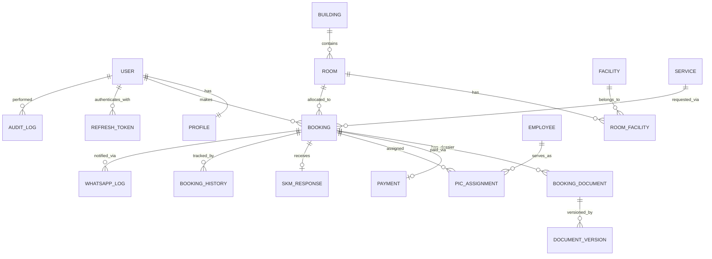

# Data Schema — CTP Digital Service Portal
# Prisma ORM + PostgreSQL 16

> Dokumen ini adalah referensi lengkap schema database. Single source of truth ada di `backend/prisma/schema.prisma`.

---

## 1. Model Overview

| Model | Domain | Keterangan |
|---|---|---|
| User | Auth | Akun pengguna sistem |
| Profile | Auth | Data profil pemohon |
| RefreshToken | Auth | JWT refresh token storage |
| Building | Master | Gedung (CTP/BITC) |
| Room | Master | Ruangan dalam gedung |
| Facility | Master | Fasilitas/peralatan |
| RoomFacility | Master | Junction ruangan-fasilitas |
| Tariff | Master | Tarif per ruangan/layanan |
| Service | Master | Katalog layanan |
| ApplicantCategory | Master | Kategori pemohon |
| CreativeSector | Master | 17 subsektor ekonomi kreatif |
| Holiday | Master | Kalender hari libur |
| Announcement | Master | Pengumuman di beranda |
| Booking | Core | Booking/permohonan layanan |
| BookingHistory | Core | Histori reschedule/perubahan |
| BookingDocument | Document | Dokumen dalam dossier |
| DocumentVersion | Document | Versi dokumen (immutable history) |
| DocumentTemplate | Document | Template surat/dokumen |
| Payment | Payment | Pembayaran per booking |
| PicAssignment | PIC | Penugasan PIC |
| Employee | PIC | Data pegawai internal |
| SkmResponse | SKM | Respons survei kepuasan |
| WhatsappLog | WA | Log pesan WhatsApp |
| WhatsappTemplate | WA | Template pesan WA |
| AuditLog | Audit | Audit trail (immutable) |
| IntegrationLog | Integration | Log integrasi eksternal |
| FokusCatalog | FOKUS | Katalog foto produk |
| Favorite | Portal | Favorit pemohon |

---

## 2. Enums

```prisma
enum Role { PEMOHON ADMIN KASUBAG_TU KEPALA_UPTD SEKRETARIS KEPALA_DINAS }
enum BookingUnit { HOURLY FULL_DAY BOTH }
enum BookingState { DRAFT SUBMITTED UNDER_REVIEW REVISION_NEEDED APPROVED WAITING_PAYMENT ACTIVE COMPLETED REJECTED CANCELLED }
enum TariffUnit { HOURLY DAILY MONTHLY FREE }
enum BookingType { ROOM WORKING_SPACE VIRTUAL_OFFICE STUDIO OTHER }
enum DocType { SURAT_PERMOHONAN PROPOSAL SURAT_PERNYATAAN TTD E_METERAI DISPOSISI BUKTI_BAYAR BUKTI_BOOKING ADMIN_NOTE SKM OTHER }
enum DocSource { APPLICANT ADMIN WHATSAPP }
enum ChangeType { RESCHEDULE ROOM_CHANGE DATA_CORRECTION PIC_CHANGE }
enum PaymentState { PENDING PROOF_UPLOADED VERIFIED REJECTED }
enum PaymentSource { APPLICANT_PORTAL ADMIN_WHATSAPP }
enum PicRole { MAIN_PIC VIDEOTRON_OPERATOR CLEANING_STAFF TECHNICIAN OTHER }
enum SkmState { PENDING COMPLETED TIMEOUT }
enum WaDirection { OUTBOUND INBOUND }
enum WaStatus { QUEUED SENT DELIVERED FAILED }
enum AuditAction { CREATE UPDATE STATE_CHANGE DELETE APPROVE REJECT CANCEL RESCHEDULE PAYMENT_VERIFY PIC_ASSIGN }
enum IntegrationName { WADUH PKL FOKUS WHATSAPP }
enum HolidayType { NATIONAL REGIONAL SPECIAL }
enum Audience { PUBLIC INTERNAL }
enum AnnouncePriority { NORMAL IMPORTANT URGENT }
enum FavoriteType { ROOM SERVICE WORKING_SPACE }
enum SourceChannel { PORTAL ADMIN WHATSAPP }
```

---

## 3. Auth & Users

```prisma
model User {
  id           String    @id @default(cuid())
  email        String    @unique
  passwordHash String
  role         Role      @default(PEMOHON)
  isActive     Boolean   @default(true)
  createdAt    DateTime  @default(now())
  updatedAt    DateTime  @updatedAt
  profile      Profile?
  refreshTokens RefreshToken[]
  bookings     Booking[]
  auditLogs    AuditLog[] @relation("PerformedBy")
  @@index([email])
  @@index([role])
}

model Profile {
  id                  String   @id @default(cuid())
  userId              String   @unique
  fullName            String
  nikEncrypted        String?  // AES-256-GCM encrypted
  phone               String?
  organizationName    String?
  organizationType    String?
  applicantCategoryId String?
  creativeSectorId    String?
  createdAt           DateTime @default(now())
  updatedAt           DateTime @updatedAt
  user                User     @relation(fields: [userId], references: [id])
  applicantCategory   ApplicantCategory? @relation(fields: [applicantCategoryId], references: [id])
  creativeSector      CreativeSector?    @relation(fields: [creativeSectorId], references: [id])
}

model RefreshToken {
  id        String   @id @default(cuid())
  userId    String
  tokenHash String   @unique  // SHA-256 hash of actual token
  expiresAt DateTime
  createdAt DateTime @default(now())
  user      User     @relation(fields: [userId], references: [id], onDelete: Cascade)
  @@index([userId])
}
```

**Catatan:**
- NIK disimpan terenkripsi (`nikEncrypted`), decrypt hanya untuk Admin view
- Refresh token di-hash sebelum disimpan, original token tidak pernah di-store

---

## 4. Master Data

```prisma
model Building {
  id          String  @id @default(cuid())
  name        String
  code        String  @unique  // "CTP" atau "BITC"
  address     String?
  description String?
  photoUrl    String?
  isActive    Boolean @default(true)
  rooms       Room[]
}

model Room {
  id                        String      @id @default(cuid())
  buildingId                String
  name                      String
  capacityMin               Int?        // null = tidak ada minimum
  capacityMax               Int
  bookingUnit               BookingUnit @default(HOURLY)  // Admin configure per ruangan
  operationalHoursStart     Float?      // e.g. 8.0 = 08:00
  operationalHoursEnd       Float?      // e.g. 17.0 = 17:00
  operationalDays           String?     // e.g. "Mon-Fri"
  requiresPic               Boolean     @default(true)   // Semua ruangan wajib min 1 PIC
  requiresVideotronOperator Boolean     @default(false)  // Convention Hall CTP only
  requiresCleaningStaff     Boolean     @default(false)
  requiresTechnician        Boolean     @default(false)
  isActive                  Boolean     @default(true)
  building                  Building    @relation(fields: [buildingId], references: [id])
  tariffs                   Tariff[]
  facilities                RoomFacility[]
  bookings                  Booking[]
  @@index([buildingId])
  @@index([isActive])
}

model Facility {
  id          String  @id @default(cuid())
  name        String
  icon        String?
  description String?
  category    String?
  rooms       RoomFacility[]
}

model RoomFacility {
  roomId     String
  facilityId String
  room       Room     @relation(fields: [roomId], references: [id])
  facility   Facility @relation(fields: [facilityId], references: [id])
  @@id([roomId, facilityId])
}

model Tariff {
  id          String      @id @default(cuid())
  roomId      String?
  serviceId   String?
  amount      Decimal     @db.Decimal(15, 2)
  unit        TariffUnit
  dateFrom    DateTime
  dateTo      DateTime?   // null = berlaku sampai diganti
  legalBasis  String?     // Nomor Perda/SK
  isActive    Boolean     @default(true)
  createdAt   DateTime    @default(now())
  @@index([roomId])
  @@index([serviceId])
  @@index([isActive])
}

model Service {
  id                  String      @id @default(cuid())
  name                String
  code                String      @unique
  description         String?
  category            String?
  iconUrl             String?
  isActive            Boolean     @default(true)
  isBookable          Boolean     @default(true)
  bookingType         BookingType
  requiresDisposition Boolean     @default(true)
  requiresPayment     Boolean     @default(true)
  sequence            Int         @default(0)
  bookings            Booking[]
}

model ApplicantCategory {
  id                        String    @id @default(cuid())
  name                      String
  code                      String    @unique  // OPD, EKRAF, OTHER
  requiresLeadershipApproval Boolean  @default(false)
  profiles                  Profile[]
}

model CreativeSector {
  id          String    @id @default(cuid())
  name        String
  code        String    @unique
  description String?
  profiles    Profile[]
}

model Holiday {
  id          String      @id @default(cuid())
  name        String
  date        DateTime    @db.Date
  holidayType HolidayType
  description String?
  isActive    Boolean     @default(true)
  @@index([date])
}

model Announcement {
  id            String           @id @default(cuid())
  title         String
  body          String           // HTML content
  publishedDate DateTime?
  expiryDate    DateTime?
  isPublished   Boolean          @default(false)
  audience      Audience
  priority      AnnouncePriority @default(NORMAL)
  createdById   String
  createdAt     DateTime         @default(now())
  @@index([isPublished])
  @@index([audience])
}
```

---

## 5. Booking (CENTRAL MODEL)

```prisma
model Booking {
  id                  String        @id @default(cuid())
  bookingNumber       String        @unique  // Auto: BK-2024-0001
  serviceId           String
  roomId              String?
  buildingId          String?       // Denormalized dari room.buildingId
  userId              String
  organizationName    String?       // Nama instansi/OPD
  applicantCategoryId String?
  creativeSectorId    String?
  activityName        String
  activityDescription String?
  expectedAttendees   Int
  dateStart           DateTime
  dateEnd             DateTime
  state               BookingState  @default(DRAFT)
  priorityReason      String?       // Internal only, tidak tampil ke pemohon
  dispositionDate     DateTime?
  dispositionRef      String?
  approvedById        String?
  approvedAt          DateTime?
  rejectedReason      String?
  cancelledReason     String?
  cancelledById       String?
  cancelledAt         DateTime?
  isCancelledAfterH7  Boolean       @default(false)  // Flag untuk audit
  rescheduleCount     Int           @default(0)      // Max 3
  checkoutAt          DateTime?
  skmDone             Boolean       @default(false)
  skmReminderSent     Boolean       @default(false)
  tariffId            String?
  totalAmount         Decimal?      @db.Decimal(15, 2)
  paymentDeadline     DateTime?     // Computed saat approval: dateStart - 24h
  notes               String?       // Catatan internal Admin
  sourceChannel       SourceChannel @default(PORTAL)
  createdAt           DateTime      @default(now())
  updatedAt           DateTime      @updatedAt
  user                User          @relation(fields: [userId], references: [id])
  room                Room?         @relation(fields: [roomId], references: [id])
  service             Service       @relation(fields: [serviceId], references: [id])
  documents           BookingDocument[]
  payment             Payment?
  picAssignments      PicAssignment[]
  history             BookingHistory[]
  skmResponse         SkmResponse?
  whatsappLogs        WhatsappLog[]
  @@index([userId])
  @@index([roomId])
  @@index([state])
  @@index([dateStart])
  @@index([bookingNumber])
}

model BookingHistory {
  id           String     @id @default(cuid())
  bookingId    String
  changeType   ChangeType
  changedById  String
  changedAt    DateTime   @default(now())
  oldDateStart DateTime?
  newDateStart DateTime?
  oldDateEnd   DateTime?
  newDateEnd   DateTime?
  oldRoomId    String?
  newRoomId    String?
  reason       String     // Wajib diisi
  booking      Booking    @relation(fields: [bookingId], references: [id])
  @@index([bookingId])
}
```

**Computed Fields (dihitung di service layer, tidak disimpan):**
- `isComplete`: true jika PIC >= 1 assigned AND (payment verified OR tidak berbayar) AND (disposisi ada OR tidak wajib)
- `isPaymentOverdue`: true jika `now() > paymentDeadline` AND `payment.state != VERIFIED`

---

## 6. Documents

```prisma
model BookingDocument {
  id              String    @id @default(cuid())
  bookingId       String
  docType         DocType
  name            String
  activeVersionId String?   // ID versi yang aktif saat ini
  source          DocSource
  notes           String?
  createdAt       DateTime  @default(now())
  booking         Booking   @relation(fields: [bookingId], references: [id])
  versions        DocumentVersion[]
  @@index([bookingId])
  @@index([docType])
}

model DocumentVersion {
  id               String   @id @default(cuid())
  documentId       String
  versionNumber    Int
  minioKey         String   // Path di MinIO bucket, bukan URL langsung
  fileName         String
  fileSize         Int      // bytes
  mimeType         String
  uploadedById     String
  uploadedAt       DateTime @default(now())
  isCurrent        Boolean  @default(true)
  supersededReason String?
  document         BookingDocument @relation(fields: [documentId], references: [id])
  @@index([documentId])
}
// IMPORTANT: DocumentVersion TIDAK BOLEH dihapus (BR-DOC-002)

model DocumentTemplate {
  id          String   @id @default(cuid())
  name        String
  docType     String
  minioKey    String   // Path template di MinIO
  description String?
  version     String?
  isActive    Boolean  @default(true)
  updatedAt   DateTime @updatedAt
}
```

---

## 7. Payment

```prisma
model Payment {
  id              String        @id @default(cuid())
  bookingId       String        @unique
  paymentRef      String?
  amount          Decimal       @db.Decimal(15, 2)
  qrisImageKey    String?       // MinIO key untuk gambar QRIS
  proofMinioKey   String?       // MinIO key untuk bukti pembayaran
  state           PaymentState  @default(PENDING)
  verifiedById    String?
  verifiedAt      DateTime?
  rejectionReason String?
  uploadedAt      DateTime?
  source          PaymentSource?
  // Toleransi H-1 — sesuai raw.md §XV: butuh persetujuan Kepala UPTD
  toleranceRequestedAt    DateTime?   // Saat Admin mengajukan toleransi
  toleranceRequestedById  String?     // Admin yang mengajukan
  toleranceApprovedById   String?     // Kepala UPTD yang memutuskan
  toleranceApprovedAt     DateTime?
  toleranceApproved       Boolean?    // true=approved, false=rejected, null=pending
  toleranceRejectedReason String?
  createdAt       DateTime      @default(now())
  updatedAt       DateTime      @updatedAt
  booking         Booking       @relation(fields: [bookingId], references: [id])
}
// isOverdue: computed di service — now() > booking.paymentDeadline && state != VERIFIED
```

---

## 8. PIC

```prisma
model Employee {
  id               String   @id @default(cuid())
  userId           String?  // Optional link ke User jika punya akun
  fullName         String
  nip              String?
  position         String?
  unit             String?
  phoneEncrypted   String?  // AES encrypted, TIDAK PERNAH expose ke Pemohon
  isActive         Boolean  @default(true)
  canBePic         Boolean  @default(false)
  picCompetencies  String[] // e.g. ["MAIN_PIC", "VIDEOTRON_OPERATOR"]
  picAssignments   PicAssignment[]
  @@index([canBePic])
  @@index([isActive])
}

model PicAssignment {
  id                      String   @id @default(cuid())
  bookingId               String
  employeeId              String
  role                    PicRole  @default(MAIN_PIC)
  dateStart               DateTime
  dateEnd                 DateTime
  isActive                Boolean  @default(true)
  assignedById            String
  assignedAt              DateTime @default(now())
  replacedByAssignmentId  String?  // Self-reference jika ada penggantian
  replacementReason       String?
  whatsappNotified        Boolean  @default(false)
  booking                 Booking  @relation(fields: [bookingId], references: [id])
  employee                Employee @relation(fields: [employeeId], references: [id])
  @@index([bookingId])
  @@index([employeeId])
  @@index([dateStart, dateEnd])
}
```

---

## 9. SKM

```prisma
model SkmResponse {
  id            String    @id @default(cuid())
  bookingId     String    @unique
  userId        String
  respondedAt   DateTime?
  overallScore  Float?    // 1-4 skala likert
  serviceScore  Float?
  facilitiesScore Float?
  staffScore    Float?
  comments      String?
  state         SkmState  @default(PENDING)
  booking       Booking   @relation(fields: [bookingId], references: [id])
  @@index([state])
}
```

---

## 10. WhatsApp

```prisma
model WhatsappLog {
  id                  String    @id @default(cuid())
  bookingId           String?
  direction           WaDirection
  messageType         String?
  recipientPhoneMasked String?  // Masked: +62812****5678
  messageBody         String?
  sentAt              DateTime  @default(now())
  status              WaStatus  @default(QUEUED)
  errorMessage        String?
  sentById            String?
  templateKey         String?
  booking             Booking?  @relation(fields: [bookingId], references: [id])
  @@index([bookingId])
  @@index([status])
}

model WhatsappTemplate {
  id            String   @id @default(cuid())
  name          String
  templateKey   String   @unique  // e.g. "booking_approved", "payment_request"
  body          String   // Template text dengan {{variable}}
  variables     Json?    // Array of variable names
  language      String   @default("id")
  isActive      Boolean  @default(true)
  approvedByBsp Boolean  @default(false)  // Harus disetujui BSP sebelum bisa dipakai
}
```

---

## 11. Audit & Integration

```prisma
model AuditLog {
  id            String      @id @default(cuid())
  model         String      // Nama tabel, e.g. "Booking"
  recordId      String      // ID record yang diubah
  recordRef     String?     // Human-readable ref, e.g. "BK-2024-0001"
  action        AuditAction
  fieldName     String?     // Field yang berubah (untuk UPDATE)
  oldValue      String?
  newValue      String?
  performedById String
  performedAt   DateTime    @default(now())
  reason        String?     // Wajib untuk aksi kritikal
  ipAddress     String?
  performedBy   User        @relation("PerformedBy", fields: [performedById], references: [id])
  @@index([model, recordId])
  @@index([performedById])
  @@index([performedAt])
}
// IMMUTABLE: tidak ada update atau delete setelah dibuat (enforced di service layer)

model IntegrationLog {
  id              String          @id @default(cuid())
  integrationName IntegrationName
  direction       String          // "outbound" | "inbound"
  endpoint        String?
  requestPayload  Json?
  responsePayload Json?
  statusCode      Int?
  success         Boolean
  errorMessage    String?
  timestamp       DateTime        @default(now())
  retryCount      Int             @default(0)
  @@index([integrationName])
  @@index([timestamp])
}
```

---

## 12. Other

```prisma
// Parameter workflow yang dapat dikonfigurasi Admin — sesuai raw.md §XVI: "harus dijadikan parameter"
model SystemConfig {
  key         String   @id  // e.g. "cancellationWindowDays"
  value       String        // Disimpan sebagai string, di-parse oleh service layer
  description String?       // Penjelasan parameter untuk Admin
  updatedAt   DateTime @updatedAt
  updatedById String?
}
// Default values (di-seed saat first run):
// cancellationWindowDays   = "7"   (H-7 pembatalan — BR-BOOKING-006)
// rescheduleWindowDaysRegular   = "3"   (H-3 reschedule ruangan biasa — BR-RESCHEDULE-001)
// rescheduleWindowDaysConvHall  = "30"  (H-30 reschedule Convention Hall — BR-RESCHEDULE-001)
// skmTimeoutDays           = "14"  (TBD oleh Admin — BR-SKM-001)

model FokusCatalog {
  id             String   @id @default(cuid())
  productName    String
  category       String?
  ownerName      String?
  description    String?
  photoDate      DateTime? @db.Date
  photoMinioKeys String[]  // Array MinIO keys untuk foto
  isActive       Boolean  @default(true)
  isFeatured     Boolean  @default(false)
}

model Favorite {
  id           String       @id @default(cuid())
  userId       String
  favoriteType FavoriteType
  roomId       String?
  serviceId    String?      // Untuk WORKING_SPACE: mengacu ke serviceId SVC-005, bukan unit WADUH spesifik
  createdAt    DateTime     @default(now())
  @@unique([userId, favoriteType, roomId, serviceId])
  @@index([userId])
}
```

---

## 13. ER Diagram (Key Relations)



---

## 14. Prisma Conventions

- **Primary keys**: selalu `String @id @default(cuid())`
- **Timestamps**: `createdAt DateTime @default(now())` dan `updatedAt DateTime @updatedAt`
- **Enums**: selalu gunakan Prisma enum, bukan String column
- **Indexes**: `@@index` pada semua foreign key dan field yang sering di-filter/sort
- **Soft delete**: `isActive Boolean @default(true)` untuk master data; dokumen tidak pernah dihapus
- **Immutable records**: AuditLog dan DocumentVersion tidak boleh di-update/delete (enforced di service layer)
- **Decimal**: gunakan `Decimal @db.Decimal(15, 2)` untuk field uang
- **Sensitive data**: simpan encrypted (NIK, phone PIC), bukan plaintext
